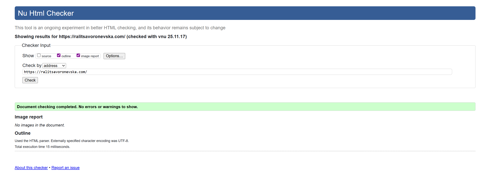
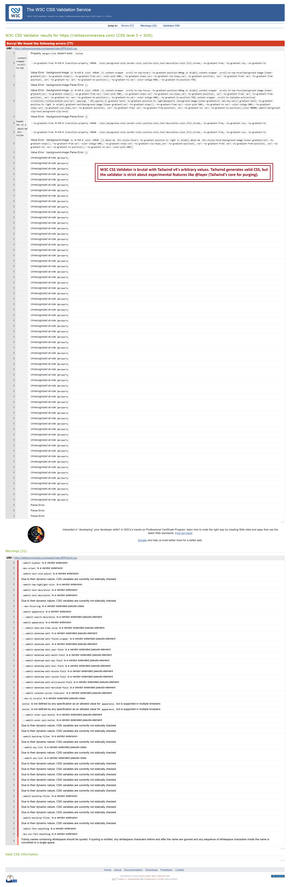
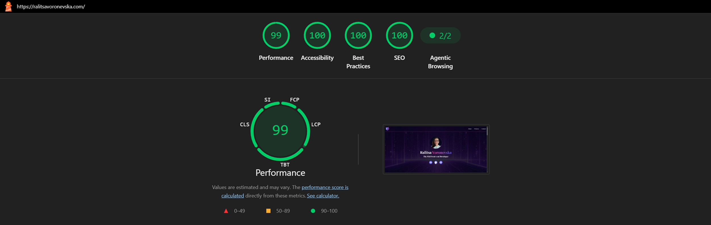
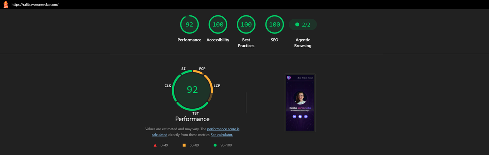
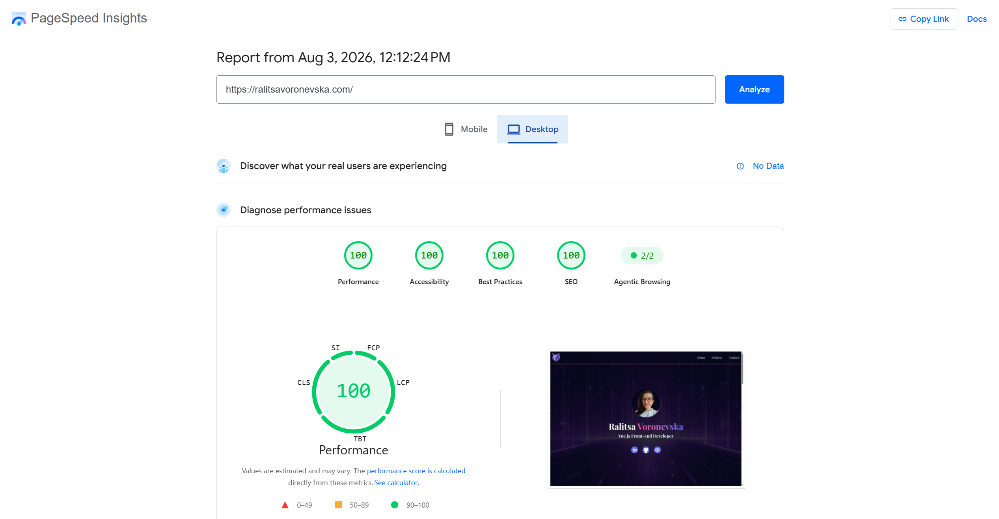
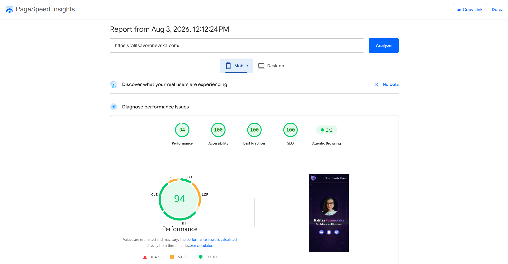
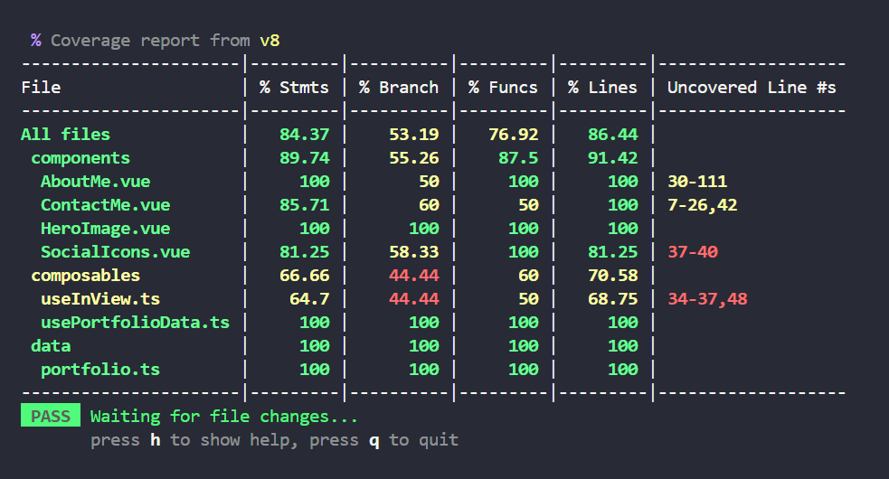

# 🚀 Vue Portfolio

📝 [CodePen](https://codepen.io/ralitsavoronevska/pen/KOdQJZ/)
🔗 [Live GitHub Preview](https://ralitsavoronevska.com/)

<details>
<summary>📸 Screenshots</summary>

## 🖥️ Desktop preview:


<table width="100%">
  <thead>
    <tr>
      <th width="65%">📱 Tablet Preview</th>
      <th width="35%">📱 Mobile Preview</th>
    </tr>
  </thead>
  <tbody>
    <tr>
      <td width="65%"></td>
      <td width="35%"></td>
    </tr>
  </tbody>
</table>

<br>

# 🏅 W3C HTML Validator



<br>

# 🏅 W3C CSS Validator



<br>

# 🌈 Chrome LightHouse Audit

Desktop:



<br>

Mobile:



<br>

# ⚡ PageSpeed Insights Results

Desktop:



<br>

Mobile:



</details>  
        
<br>

# 🛠️ Built with:


    
    



🔨 Fully Responsive, Mobile First Approach, Transitions, Animations, Grid & Flex Layout  
⛏️ [Google Font: Playfair Display](https://fonts.google.com/specimen/Playfair+Display/)  
🪚 [Developer Icons](https://devicon.dev/)

<br>

# ✨ Features:

✅ Modern Matrix-like Themed Personal Portfolio Webpage  
✅ Fixed navigation with slick blur and smooth scroll  
✅ Colorful Classic Developer icons  
✅ Elegant scroll-to-top button

<br>

# 🧰 Online resources and tools:

🖼️ [Photopea [Online Photo Editor]](https://www.photopea.com/)

<br>

# 🌐 Browser Support:

(Last updated and tested: 03/08/2026)  
🌟 Chrome 150.0.7871.187 (64-bit)  
🦊 Firefox 153.0.1 (64-bit)  
🏴‍☠️ Opera 133.0.5932.85 (64-bit)  
🪟 Edge 151.0.4129.59 (64-bit)

<br>

# 🧪 Online Validators:

✔️ [W3C HTML Validator](https://validator.w3.org/)  
✔️ [W3C CSS Validator](https://jigsaw.w3.org/css-validator/)  
💡 [LightHouse Audit](https://developers.google.com/web/tools/lighthouse/)  
⚡ [PageSpeed Insights Audit](https://pagespeed.web.dev/)  
⭐ [WebPageTest](https://www.webpagetest.org/)

<br>

<br>

## Setup

Make sure to install the dependencies:

```bash
# npm
npm install
```

<br>

## Development Server

Start the development server on `http://localhost:5173`:

```bash
# npm
npm run dev
```

<br>

## Production

Locally preview the production build:

```bash
# npm
npm run preview
```

<br>

# 🌟 Inspiration & Credits:

🪄 [Grok 4](https://grok.com/)  
:octocat: [GitHub Coplit](https://github.com/features/copilot)  
🌃 [Adobe Firefly](https://firefly.adobe.com/)  
📑 https://mdbootstrap.com/docs/standard/components/cards  
:globe_with_meridians: [Abdullah Iqbal's Vercel Portfolio](https://abdullah-portfolio-dev.vercel.app/)

---

🙌 Thank you for checking out my project! More is coming 🔜.  
Stay tuned 🚀 and please don't forget to give the project a star! ⭐  
Made with lots of 💗, ☕, and a sprinkle of ✨ by Ralitsa Voronevska!
